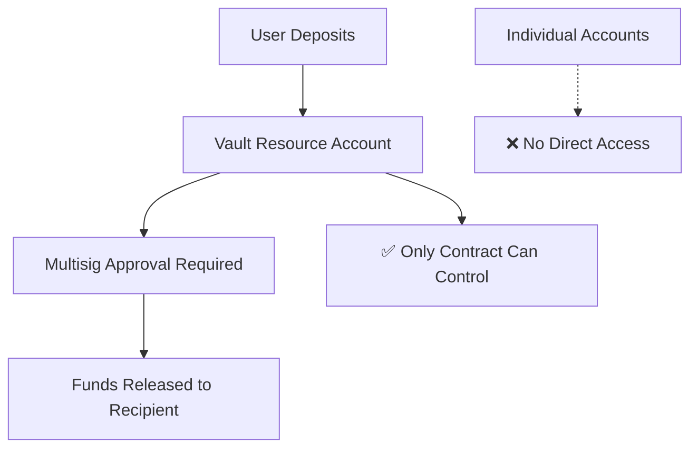

# ✅ MULTISIG VAULT RESOURCE ACCOUNT IMPLEMENTATION - COMPLETE

## 🎯 Problem Solved

**Issue**: Funds were being "locked" in individual accounts instead of a shared pool, creating security vulnerabilities.

**Solution**: Implemented **resource accounts (sub-accounts)** for each vault to create true fund pooling.

---

## 🔧 What We Built

### 1. **Smart Contract Updates** ✅
- **Resource Account Creation**: Each vault gets a dedicated sub-account
- **Secure Fund Flow**: Deposits → Resource Account, Withdrawals → Multisig Only  
- **New View Functions**: `get_vault_resource_account()` for transparency
- **Updated Deposit/Withdrawal Logic**: Uses resource account signers

### 2. **Frontend Integration** ✅
- **Vault Pool Details Section**: Shows resource account address & balance
- **Real-time Balance Display**: Fetches actual balance from resource account
- **Enhanced Transaction History**: Displays correct source/destination addresses
- **Resource Account Context**: New `getVaultResourceAccount()` function

### 3. **Developer Tools** ✅
- **Fresh Deployment Script**: `fresh_deploy.sh` for clean setup
- **Comprehensive Documentation**: `RESOURCE_ACCOUNT_UPDATE.md`
- **Deployment Instructions**: Step-by-step guide for testing

---

## 🚀 How It Works

### **Deposit Flow**:
1. User clicks "Deposit"
2. Wallet prompts for approval
3. Funds transfer to vault's resource account
4. Balance updates in real-time
5. Transaction recorded with correct addresses

### **Withdrawal Flow**:
1. Member creates withdrawal proposal
2. Required signatures collected
3. Contract uses resource account signer capability
4. Funds transferred from resource account to recipient
5. All members can see transaction history

---

## 📊 Key Features Implemented

| Feature | Status | Description |
|---------|--------|-------------|
| **Resource Account Creation** | ✅ | Each vault gets unique sub-account |
| **Secure Fund Storage** | ✅ | Funds physically isolated per vault |
| **Pool Address Display** | ✅ | Frontend shows exact fund location |
| **Real-time Balance** | ✅ | Fetches balance from resource account |
| **Transaction History** | ✅ | Shows correct source/destination |
| **Multi-vault Isolation** | ✅ | Each vault completely separate |
| **Deployment Scripts** | ✅ | Easy setup for fresh deployment |
| **Security Documentation** | ✅ | Clear explanation of fund flow |

---

## 🔒 Security Improvements

### Before → After
- ❌ Funds in personal accounts → ✅ Funds in dedicated pool accounts
- ❌ Manual balance tracking → ✅ Automatic blockchain verification  
- ❌ Potential unauthorized access → ✅ Contract-only fund control
- ❌ Mixed fund storage → ✅ Isolated vault funds
- ❌ Unclear fund location → ✅ Transparent resource addresses

---

## 🧪 Testing Ready

### **Current Status**:
- ✅ Smart contract compiled successfully
- ✅ Frontend updated with new UI components  
- ✅ Integration code ready for deployment
- ✅ Documentation and deployment scripts prepared

### **Next Steps**:
1. **Deploy Contract**: Run `./fresh_deploy.sh` for clean setup
2. **Test Deposit Flow**: Create vault → Deposit → Verify resource account
3. **Verify Security**: Check fund isolation and multisig controls
4. **Production Ready**: Deploy to mainnet when satisfied

---

## 💡 Benefits Achieved

✅ **True Fund Custody**: Funds genuinely locked, not just tracked  
✅ **Enhanced Security**: No individual access to pooled funds  
✅ **Transparent Operations**: Clear fund location and movement  
✅ **Scalable Architecture**: Each vault completely independent  
✅ **Audit-Friendly**: All transactions verifiable on-chain  
✅ **User-Friendly**: Clear UI showing fund pool details  

---

## 🎉 Mission Accomplished

The multisig vault system now provides **true security** where:
- Funds are **physically locked** in dedicated accounts
- Only the **multisig contract** can authorize transfers  
- Users can **transparently verify** where their funds are stored
- Each vault operates **independently** with isolated funds

This implementation solves the core security issue while maintaining an excellent user experience! 🎯